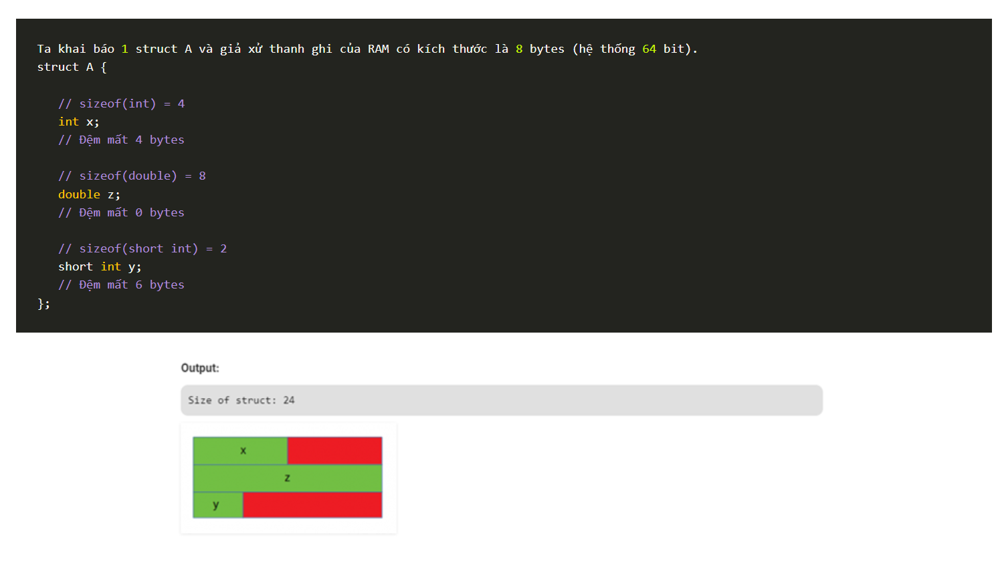

 <details>
  <summary><h2>▶ C programming language</h2></summary>

<details>
  <summary><h3>Kiểu dữ liệu</h3></summary>

  .PNG)
  .PNG)

</details>
<details>
  <summary><h3>Lệnh điều kiện trong C</h3></summary>

  **_Câu lệnh If_**
  - Đây là 1 câu lệnh điều kiện để kiểm tra 1 điều kiện nào có được thỏa mãn không. Nếu điều kiện được thỏa mãn thì sẽ thực thi đoạn code bên trong nó.
  `if (điều kiện){
    Khối lệnh sẽ được thực hiện nếu <điều kiện> đúng.
}`
 - Ví dụ:
```C
#include <stdio.h>
int main(){
   int a;
   printf(“Nhap a = “); scanf(“%d”, &a);
 
   if (a % 2 == 0) // a chia hết cho 2
   {
       printf(“%d la so chan”, a);
   }
   printf(“\nXong!”);
} 
```
 - Câu lệnh If else
 ```C
 if (condition)
 {
   // statement1
   // khối lệnh sẽ thực hiện nếu điều kiện đúng
}else
{
   // statement2
   // khối lệnh sẽ thực hiện nếu điều kiện sai
}
```
- Ví dụ
```C
#include <stdio.h>
 
int main(){
   int a;
   printf(“Nhap a = “); scanf(“%d”, &a);
   if (a % 2 == 0) // a chia hết cho 2
   {
       printf(“%d la so chan”, a);
   }else{
       printf(« %d la so le », a) ;
   }
} 
```

 - Câu lệnh if … else if … else:

```C
	if (test expression1) 
	{
	// statement(1)
	}
	else if(test expression2) 
	{
	// statement(2)
	}
	else if (test expression3) 
	{
	// statement(3)
	}
	…
	else 
	{
	// statement(n)
	}
```

**_switch case_**

 - Lệnh switch case là một cấu trúc điều khiển & rẽ nhánh hoàn toàn có thể được thay thế bằng cấu trúc if else. Tuy nhiên, việc sử dụng switch case sẽ giúp code của chúng ta dễ viết và dễ đọc hơn. Một điều nữa là sử dụng switch case có vẻ như cho hiệu năng tốt hơn so với sử dụng if else trong trường hợp có nhiều điều kiện có thể xảy ra.
```C
switch (expression)// tham số đầu vào 
​{
   case constant1:// điều kiện
     // statements(khối lệnh)
     break;
   case constant2:
     // statements
     break;
   default:
     // default statements
}
```
 - expression phải bắt buộc là giá trị hằng, có thể là biểu thức nhưng kết quả cần là hằng số. Trong đó, expression sẽ được so sánh với các giá trị của các case.
 - Nếu có 1 case nào đó khớp giá trị, các khối lệnh tương ứng sau case đó sẽ được thực hiện cho tới khi gặp lệnh break. Do đó, nếu chúng ta không sử dụng break thì tất cả các case kể từ case khớp giá trị đều được thực hiện.
 - Case default sẽ được thực hiện nếu không có case nào khớp giá trị với expression. 
 - Ví dụ:

```C
#include <stdio.h>

int main(void) {
int thang =1 ;
switch ( thang){
case 1:
	printf("30 ngay\n");
	break;
case 12:
	printf("28 ngay\n");
	break;
	default:
	printf("khong hop le\n");
	}
return 0;
}
	//Tổng bằng 8
```
 - Nếu không break ở cuối mỗi case thì chương trình sẽ chạy tiếp xuống các case ngay bên dưới dẫn đến chương trình có thể sai ý đồ.
 - Nhưng cố ý không break,có thể hiển thị nhiều điện kiện với 1 nội dung

```C
int main(void) {
day = Mon; 
switch (day) {
case Mon:
case Tue:
case Wed:
case Thu:
case Fri:
 	printf("Ngày trong tuần\n");
 break;
case Sat:
case Sun:
 	printf("Ngày lễ\n");
 break;
default:
 	printf("Không tồn tại\n");
}
return 0;
}
```
**_if và switch :_**
 - Lệnh switch case có hạn chế là biểu thức điều kiện phải là số nguyên. 
 - Đối với lệnh if else, biểu thức điều kiện là true hoặc false. Do vậy, một số trường hợp, bắt buộc phải sử dụng lệnh if else thay vì switch case.
 - Nên sử dụng if else trong bài toán ít trường hợp, các biểu thức điều kiện đơn giản
 - Switch sẽ so sánh các tính năng khác nhau,mã sạch sẽ hơn và dễ đọc.
 - Nên sử dụng switch case trong bài toán mul-ti choice, biểu thức điều kiện tính toán phức tạp nhưng phải có giá trị nguyên.

</details>
<details>
  <summary><h3>Vòng lặp</h3></summary>

**Vòng lặp for:** 
- Cú pháp:
```C
for ( giá trị ban đầu; điều kiện lặp; thuật toán   )
{
   // các lệnh cần lặp
}
```
- Ví dụ:
```C
for (int i =0; i<100; i=i+2 )
{
   printf("test:%d\n",i);
   if(i==50){
	break;// i chạy tới 50 sẽ thoát ra khỏi vòng for
   }
}
```
```C
for (int i =0; i<100; i=i+2 )
{
   
   if(i==50){
	continue;// khi i tới 50 , sẽ bỏ qua 50 , chạy tới giá trị i=52
   }
   printf("test:%d\n",i);
}
```
- Vòng lặp for vô hạn:
```C
int i=0;
for (;; )
{
   i++;
   printf("test:%d\n",i);
   if(i==50){
	beak;// nếu không có break thì vòng lặp chạy vô hạn
   }
   
}
```

**Vòng lặp while:**
- Cú pháp:
```C
while ( điều kiện lặp đúng )
{
   // các lệnh cần lặp
}
```
- Ví dụ:
```C
int i =0;
while ( i <10 )
{
   printf("test:%d\n",i);
   i++;   
}
```
- While được sử dụng khi
**Vòng lặp do-while:**
- Cú pháp:
```C
do{
	// các lệnh cần lặp
}
while ( điều kiện lặp đúng );
 
```
 
- do-while :Lệnh làm trước sau đó mới so sánh điều kiện 

  

</details>
<details>
  <summary><h3>Kiểu dữ liệu</h3></summary>

**Biến không đổi (Constant Variables):** 
- Lưu trữ giá trị không thay đổi trong suốt thời gian chương trình chạy.Biến này sẽ lưu vào vùng nhớ TEXT
    ```const int MAX_VALUE = 100;```

**Biến Extern:**
- Từ khóa extern được sử dụng để khai báo một biến mà đã được định nghĩa bên ngoài chương trình hoặc tệp tin.
- Biến extern không tạo ra bộ nhớ mới cho biến.Biến được tham chiếu phải được khai báo toàn cục. 
- Lưu ý: khi sử dụng extern, không được khai báo giá trị ban đầu cho biến
- File 1 ta khai báo
```C
int GlobalVariable = 0; // implicit definition 
void SomeFunction(); // function prototype (declaration) 
int main() 
{ 
  GlobalVariable = 1; 
  SomeFunction(); 
  return 0; 
}
```
- File 2, chúng ta extern biến đó để sử dụng

```C
extern int GlobalVariable; // implicit definition 
void SomeFunction(); // function prototype (declaration) 
int main() 
{ 
  GlobalVariable = 1; 
  SomeFunction(); 
  return 0; 
}; 
```

**Biến register:** Từ khóa register để báo cho chương trình biết một biến sẽ đc lưu trữ trong thanh ghi (register) của CPU để tối ưu hiệu suất.Mục đích để tính toán nhanh .
    `register int counter = 0;`
- Giải thích :Nếu khai báo biến thông thường để tính toán không có từ khóa register , thực hiện một phép tính thì cần có 3 bước.
	- Ví dụ: `int a = 6.Ví dụ :a có địa chỉ là 0X01,  a=a+4`
	- B1:Lưu địa chỉ và giá trị của biến vào bộ nhớ RAM : `0X01=6;` 
	- B2:Sau đó chuyển từ Ram qua thanh ghi(register)
	- B3:Từ register chuyển qua ALU (Arithmetic Logic Unit) ,để tính toán.Sau khi tính toán xong thì lại chuyển ngược về register>> về RAM

- Khi thêm từ khóa register để khai báo biến, biến sẽ được lưu vào register thay vào RAM >> tốc độ xử lý sẽ nhanh hơn
- Hạn chế dùng register vì thanh ghi có giới hạn (32 bit là 4 byte , 64 bit là 8 byte ) >> chỉ lưu những biến quan trọng , cần tính toán nhanh

**Biến volatile:** Thông báo cho trình biên dịch rằng giá trị của biến có thể thay đổi bất kỳ lúc nào, do đó trình biên dịch không nên tối ưu hóa.
- Ví dụ:
```C
   	int main() {
    volatile int sensorValue;

    while (1) {
        // Đọc giá trị từ cảm biến (sensor)
        sensorValue = readSensor();

        // Xử lý giá trị cảm biến
        processSensorValue(sensorValue);
    }

    return 0;
}
```
- Cảm biến thay đổi liên tục, giá trị có thể giống nhau. Tuy nhiên,nếu không có volatile tính năng tối ưu code của compiler, nó sẽ hiểu rằng các biến như vậy dường như không thay đổi giá trị nên compiler có xu hướng loại bỏ để có thể tối ưu kích cỡ file code .
- Trong hệ thống nhúng, một thanh ghi có thể bị thay đổi giá trị do những điều kiện bên ngoài. Ví dụ như mức điện áp không vượt quá ngưỡng, làm cho giá trị 0 thành 1, 1 thành 0. Hoặc, khi cổng UART nhận được đầy buffer thì thanh ghi BUFFER_READY tự động chuyển 0 thành 1… Bằng cách sử dụng biến volatile, chương trình C được compiler biên dịch sẽ đảm bảo luôn luôn đọc lại giá trị của thanh ghi,tránh mọi tối ưu của compiler.

**Biến kiểu định danh (Typedef Variables):** Tạo ra một tên mới cho một kiểu dữ liệu đã tồn tại để sử dụng dễ dàng hơn.
```C
    typedef int Integer;
    Integer number = 42;
```


**Biến liệt kê (Enum Variables):** Lưu trữ một trong các giá trị được xác định trước từ một tập hợp các giá trị có tên.
- Cú pháp:
```C
	enum Color {
        RED,//NẾU KHÔNG GÁN GÌ THÌ, MEMBER KẾ TIẾP SẼ TĂNG 1 ĐƠN VỊ, BẮT ĐẦU =0
        GREEN,
        BLUE
    };
	 
	int main(){
		printf("%d",RED); // ,IN RA LÀ 0,1,2
		printf("%d",GREEN);
		printf("%d",BLUE);
		return 0;
	}

```
- Dùng typedef định nghĩa lại enum:
- Cú pháp:
```C
	typedef enum {
        RED,//NẾU KHÔNG GÁN GÌ THÌ, MEMBER KẾ TIẾP SẼ TĂNG 1 ĐƠN VỊ, BẮT ĐẦU =0
        GREEN,
        BLUE
    } color;
		
	int main(){
		color=RED;
		printf("%d",color); // ,IN RA LÀ 0,1,2
		printf("%d",GREEN);
		printf("%d",BLUE);
		return 0;
	}

```
- Enum sẽ đi cùng Switch Case:
```C
	typedef enum {
        RED, 
        GREEN,
        BLUE
    } color;
	void hienthi(color mau)
	{
		switch (mau){
			case RED:
			printf("mau do");
			break;
			case BLUE:
			printf("mau xanh");
			break;


		}

	}
		
	int main(){
		color mau;
		mau = red;
		hienthi(mau);
	 
		return 0;
	}

```


**Biến cấu trúc (Structure Variables):** Lưu trữ các thành phần có liên quan vào một biến.:** Định nghĩa và sử dụng kiểu dữ liệu tùy chỉnh trong ngôn ngữ C.
```C
	typedef struct {
    	float x1;
    	float x2;
	} nghiem;// chỗ này định danh lại 
	 
	nghiem ptbac2(int a , int b , int c){
		nghiem test;//nghiem là kiểu dữ liệu , test là biến
		test.x1 =20.3;
		test.x2 =14.2;
		return test;

	}
	int main(){
		nghiem phuongtrinh = ptbac2(2,3,4);
		printf("x1:%f",phuongtrinh.x1);
		printf("x2:%f",phuongtrinh.x2);
	 
		return 0;
	}
```


</details>
<details>
  <summary><h3>Quá trình biên dịch</h3></summary>
	
Quy trình biên dịch là quá trình chuyển đổi từ ngôn ngữ bậc cao (NNBC) (C/C++, Pascal, Java, C#…) sang ngôn ngữ đích (ngôn ngữ máy) để máy tính có thể hiểu và thực thi.
### Quá trình biên dịch bao gồm 4 giai đoạn:
	
- **_Pre-processor (Giai đoạn tiền xử lý):_** Nhận mã nguồn và xóa bỏ các dòng comments, xử lý các chỉ thị tiền xử lý có bắt đầu bằng kí hiệu `#`. Như `#include` , `#define` .
	- `#include` được sử dụng để chèn nội dung của một tệp (thường là một tệp tiêu đề), `ví dụ :header.h` vào trong mã nguồn.
	-  Khi chương trình được biên dịch, nội dung của `header.h ` sẽ được chèn vào vị trí của `#include`.
	-  Khi chương trình được biên dịch, các định nghĩa ` #define` sẽ thay bằng giá trị cụ thể  vào mã nguồn.Giống như việc bạn thay thế tất cả các thể hiện của PI bằng giá trị 3.14159 
	-  Sau khi qua quá trình tiền xử lý thì file code lúc này sẽ có dạng `.i`.
	-  Dùng lệnh `gcc -E filename.c -o filename.i` hoặc `gcc -E filename.c` để xem code sau khi qua quá trình preprocessor.
- **_Compiler (Giai đoạn dịch NNBC sang ngôn ngữ Assembly):_** Kiểm tra các kiểu dữ liệu có lỗi hay không, phân tích cú pháp (syntax) của mã nguồn NNBC và tối ưu code.
	-  Quá trình này sẽ biên dịch từ code `.i` sang ngôn ngữ assembly `.s`.
	-  Dùng lệnh `gcc -S -o filename.s filename.c` để có thể xem code sau 	quá tình compiler.
- **_Assembler (Giai đoạn dịch ngôn ngữ Assembly sang ngôn ngữ máy):_** Biên dịch ngôn ngữ Assembly sang ngôn ngữ máy (0 và 1). Và tạo ra tệp tin Object `.o` or `.obj`.
	-  Dùng lệnh `gcc -c filename.c -o filename.o` để tạo ra file ".o" và dùng lệnh `objdump -d -Mintel filename.o` để xem code.
- **_Linker (Giải đoạn liên kết):_** Trong giai đoạn này mã máy của một chương trình `.o` dịch từ nhiều nguồn (file .c hoặc file thư viện .lib) được liên kết lại với nhau để tạo thành chương trình đích nhất. Mã máy của các hàm thư viện gọi trong chương trình cũng được đưa vào chương trình cuối trong giai đoạn này. Chính vì vậy mà các lỗi liên quan đến việc gọi hàm hay sử dụng biến tổng thể mà không tồn tại sẽ bị phát hiện. Kể cả lỗi viết chương trình chính không có hàm main() cũng được phát hiện trong liên kết.
	- File sau khi được gộp lại thì sẽ có đuôi mở rộng Executable `.exe`, còn trên Linux và MacOs thì có thể có đuối theo chỉ định hoặc không có đuôi mở rộng.

- Để chạy file code C trên `terminal` dùng lệnh `gcc -o filename filename.c` đẻ tạo ra tệp thực thi, sau đó dùng lệnh `./filename` để chạy tệp thực thi đó.

</details>
<details>
  <summary><h3>Phân vùng bộ nhớ trên RAM, cấp phát bộ nhớ động</h3></summary>
	
### Phân vùng bộ nhớ trên RAM(5 vùng)

| Stack |
|:-----:|
|   ↓   |
|   ↑   |	
|  Heap |
|  Bss(Uninitialized data)  |
|  Data(Initialized data)   |
|  Text |
- ***Text:*** Quyền truy cập chỉ có thể Read( không thay đổi)
	- Chứa khai báo các hằng số(.rodata)
	- Nó chưa lệnh thực thi nên tránh sửa đổi instruction
	- Biến const được lưu vào text 
- ***Data:*** Quyền truy cập Read-Write
	- Chứa biến toàn cục hoặc biến static khác 0
	- Được giải phóng khi kết thúc chương trình
- ***Bss:*** Quyền truy cập Read-Write
	- Chứa biến toàn cục hoặc các biến static bằng 0 hoặc không khởi tạo
	- Được giải phóng khi kết thúc chương trình
- ***Stack:*** Quyền truy cập là Read-Write.
	- Được sử dụng cấp phát cho biến local, input parameter của hàm,...
	- Sẽ được giải phóng khi ra khỏi block code/hàm
- ***Heap:*** Quyền truy cập là Read-Write.
	- Được sử dụng để cấp phát bộ nhớ động như: Malloc, Calloc,...
	- Sẽ được giải phóng khi gọi hàm free,...
	### So sánh Stack và Heap?
	- Bộ nhớ: Bộ nhớ Heap và bộ nhớ Stack bản chất đều cùng là vùng nhớ được tạo ra và lưu trữ trong RAM khi chương trình được thực thi.
		- Stack được dùng để lưu trữ các biến cục bộ trong hàm, tham số truyền vào... Truy cập vào bộ nhớ này rất nhanh và được thực thi khi chương trình được biên dịch.
		- Heap được dùng để lưu trữ vùng nhớ cho những biến con trỏ được cấp phát động bởi các hàm malloc - calloc - realloc (trong C)
	- Kích thước vùng nhớ:
		- Stack: kích thước của bộ nhớ Stack là cố định, tùy thuộc vào từng hệ điều hành, ví dụ hệ điều hành Windows là 1 MB, hệ điều hành Linux là 8 MB (lưu ý là con số có thể khác tùy thuộc vào kiến trúc hệ điều hành của bạn).
		- Heap: kích thước của bộ nhớ Heap là không cố định, có thể tăng giảm do đó đáp ứng được nhu cầu lưu trữ dữ liệu của chương trình.
	- Đặc điểm vùng nhớ
		- Stack: vùng nhớ Stack được quản lý bởi hệ điều hành, dữ liệu được lưu trong Stack sẽ tự động hủy khi hàm thực hiện xong công việc của mình.
		- Heap: Vùng nhớ Heap được quản lý bởi lập trình viên (trong C hoặc C++), dữ liệu trong Heap sẽ không bị hủy khi hàm thực hiện xong, điều đó có nghĩa bạn phải tự tay hủy vùng nhớ bằng câu lệnh free (trong C), và delete hoặc delete [] (trong C++), nếu không sẽ xảy ra hiện tượng rò rỉ bộ nhớ. 
	### Lưu ý: 
	- Việc tự động dọn vùng nhớ còn tùy thuộc vào trình biên dịch trung gian.
	- Vấn đề lỗi xảy ra đối với vùng nhớ Stack: Bởi vì bộ nhớ Stack cố định nên nếu chương trình bạn sử dụng quá nhiều bộ nhớ vượt quá khả năng lưu trữ của Stack chắc chắn sẽ xảy ra tình trạng tràn bộ nhớ Stack (Stack overflow), các trường hợp xảy ra như bạn khởi tạo quá nhiều biến cục bộ, hàm đệ quy vô hạn,..
		- Ví dụ về tràn bộ nhớ stack với hàm đệ quy vô hạn:
		```C
		int foo(int x){
			printf("De quy khong gioi han\n");
			return foo(x);
		}
		```
	- Vấn đề lỗi xảy ra đối với vùng nhớ Heap: Nếu bạn liên tục cấp phát vùng nhớ mà không giải phóng thì sẽ bị lỗi tràn vùng nhớ Heap (Heap overflow). Nếu bạn khởi tạo một vùng nhớ quá lớn mà vùng nhớ Heap không thể lưu trữ một lần được sẽ bị lỗi khởi tạo vùng nhớ Heap thất bại.
		- Ví dụ trường hợp khởi tạo vùng nhớ Heap quá lớn:
		```C 
		int *A = (int *)malloc(18446744073709551615); 
		```
	### Các cách sử dụng malloc, calloc, realloc, free:
	- ***Malloc:*** Cấp phát bộ nhớ động chưa có giá trị khởi tạo cho mỗi phần tử, trả về con trỏ NULL khi cấp phát thành công
	```C 
	void* malloc(size_t size);
	```
	- ***Calloc:*** Cấp phát bộ nhớ động có giá trị khởi tạo ban đầu của mỗi phần tử đều là 0, trả về con trỏ NULL khi cấp phát thành công
	```C
	void* calloc(size_t num, size_t size);
	```
	- ***Realloc:*** Thay đổi kích thước bộ nhớ của bộ nhớ đã được cấp phát trước đó của Malloc và Calloc, trả về con trỏ NULL khi thay đổi thành công
	```C
	void* realloc(void* ptr, size_t size);
	```
	- ***Free:*** Giải phóng bộ nhớ đã được cấp phát bằng Malloc, Calloc, Realloc sau khi sử dụng xong, không có trả về
	```C
	void free(void* ptr);
	```
	### Khác nhau của static cục bộ và static toàn cục:
- Biến static cục bộ: Khi 1 biến cục bộ được khai báo với từ khóa 		static. Biến sẽ chỉ được khởi tạo 1 lần duy nhất và tồn tại suốt thời gian chạy chương trình. Giá trị của nó không bị mất đi ngay cả khi kết thúc hàm. Tuy nhiên khác với biến toàn cục có thể gọi trong tất cả mọi nơi trong chương trình, thì biến cục bộ static chỉ có thể được gọi trong nội bộ hàm khởi tạo ra nó. Mỗi lần hàm được gọi, giá trị của biến chính bằng giá trị tại lần gần nhất hàm được gọi.Biến static sẽ lưu vào vùng nhớ Data/ Bss, được giải phóng khi kết thúc chương trình.

- Ví dụ:

```C
 	#include <stdio.h>
	void printMessage() {
    static int count = 0;
    // Tăng giá trị biến mỗi lần hàm được gọi
    count++;
    printf("Count: %d\n", count);
	}

	int main() {
    // Gọi hàm có sử dụng biến static
    printMessage();//
    printMessage();

    return 0;
	}// KQ:Count: 1,Count: 2

```

- Biến static toàn cục: Biến toàn cục static sẽ chỉ có thể được truy cập và sử dụng trong File khai báo nó, các File khác không có cách nào truy cập được.
- Ví dụ:globalStaticVar được khai báo là static và nằm trong file "File1.c". Do đó, bạn không thể trực tiếp truy cập nó từ file "File2.c", bằng extern int globalStaticVar; trong File2.c, chương trình sẽ không biên dịch được và thông báo lỗi.
- Biến cục bộ: Biến cục bộ sẽ được lưu vào vùng nhớ stack, thu hồi khi kết thúc hàm cục bộ. 

</details>
<details>
  <summary><h3>Struct và Union</h3></summary>

**Struct và Union là 2 cấu trúc dữ liệu do lập trình viên định nghĩa bao gồm các biến với kiểu dữ liệu khác nhau.Tuy nhiên, về mặt lưu trữ trong bộ nhớ, chúng có sự khác biệt rõ rệt như sau:**
**struct:** Dữ liệu của các thành viên của struct được lưu trữ ở những vùng nhớ khác nhau. Do đó kích thước của 1 struct tối thiểu bằng kích thước các thành viên cộng lại tại vì còn phụ thuộc vào bộ nhớ đệm (struct padding).
- Ví dụ:
  ```C 
  #include <stdio.h>
  #include <conio.h>
  struct date
	{
		int d;
		int m;
		long y;
	};
  void main()
	{
		date dat = {4, 4, 2016};
		printf("\nSize of struct: %d", sizeof(date));//size 12
	
		printf("\ndate = %d", dat.d);//date=4
		printf("\nmonth = %d", dat.m);//month =4
		printf("\nyear = %d", dat.y);//year=2016
	
		getch();
	
	} 
	```

**Tại cùng 1 thời điểm run-time, có thể truy cập vào tất cả các thành phần của struct**
**Struct padding :** Chèn thêm các vùng nhớ trống giữa các member để đảm bảo việc dữ liệu trong struct được natually aligned(các thao tác đọc ghi trong bộ nhớ nhanh hơn )
> Ví dụ:

.PNG)
- Như vậy đối với struct B kích thước của nó sẽ là 16 bytes, trong đó có 14 bytes được sử dụng và 2 bytes bị padding. Chúng ta thấy rằng việc sắp xếp thứ tự các phần tử của struct có thể giúp cho việc xử dụng tài nguyên RAM trở lên hiệu quả hơn, tránh bị tốn quá nhiều bytes cho quá trình padding.

	**Sử dụng Struct khi bạn muốn lưu trữ nhiều thông tin có liên quan với nhau:**

	- Ví dụ: Một hồ sơ người dùng có tên, tuổi, địa chỉ, v.v.

	**Khi bạn muốn lưu trữ dữ liệu với các loại dữ liệu khác nhau:**
	- Ví dụ: Một khối dữ liệu đại diện cho một ngày gồm ngày, tháng, năm là các kiểu dữ liệu khác nhau.

	**Khi bạn muốn có một cấu trúc dữ liệu linh hoạt, mà mỗi thành phần có thể được truy cập một cách dễ dàng:**
	- Ví dụ: Các thành phần của một hình học như điểm, đường, v.v.

	**Union : Dữ liệu các thành viên sẽ dùng chung 1 vùng nhớ. Kích thước của union được tính là size lớn nhất của kiểu dữ liệu trong union.**
	 
	- ví dụ 1:
	```C
	#include <stdio.h>
	#include <conio.h>
 
	union date
	{
		int d;
		int m;
		int y;
	};
 
	void main()
	{
		date dat;
	
		printf("\nSize of union: %d", sizeof(date));//4
		dat.d = 24;
		dat.m = 9;
		dat.y = 2014;
	
		printf("\ndate = %d", dat.d);//2014
		printf("\nmonth = %d", dat.m);//2014
		printf("\nyear = %d", dat.y);/2014
	
		getch();
	}
	```
 - Vùng nhớ dành cho union date là 4 byte. Vùng nhớ này sẽ chứa giá trị 24 khi dat.d = 24 được thực hiện. Tiếp đó, 9 sẽ được copy đè vào vùng nhớ này khi dat.m = 9 được thực hiện. Cuối cùng, 2014 được copy đè vào vùng nhớ khi dat.y = 2014 được thực hiện.
 **Tại cùng 1 thời điểm run-time, chỉ có thể truy cập 1 thành phần của union**
- ví dụ 2:
  ```C
  #include <stdio.h>
  #include <conio.h>
  union date
  {
    int d;
    int m;
    int y;
  };
 
  void main()
  {
		date dat;
	
		printf("\nSize of union: %d", sizeof(date));//4
		
		dat.d = 24;
		printf("\ndate = %d", dat.d);//24
	
		dat.m = 9;
		printf("\nmonth = %d", dat.m);//9
	
		dat.y = 2014;
		printf("\nyear = %d", dat.y);//2014
	
		getch();
  }
  ```
- Khác với VD1 ,các giá trị được gọi lần lượt , cứ mỗi lần kết thúc giá trị sẽ có 1 giá trị mới được ghi đè vào

**Sử dụng Union khi bạn muốn tiết kiệm bộ nhớ và chỉ lưu trữ một giá trị tại một thời điểm:**
- Khi bạn gán một thành viên, các giá trị của các thành viên khác sẽ thay đổi.

</details>
<details>
  <summary><h3>Macro,Function</h3></summary>

 **Macro là gì?**

 - Marco là 1 định nghĩa (do lập trình viên đặt tên) trỏ tới 1 khối lệnh thực hiện một chức năng nào đó.

 - Được xử lý bởi preprocessor(tiền xử lý)

 - Định nghĩa macro bằng lệnh #define

 - VD: Preprocessor khi gặp bất kỳ lời gọi SUM(first+last) nào thì thay ngay bằng
 	```C
    #define SUM(a,b)     (a+b)
	int main(){
		printf("tong a,b la %d\n",sum(1,2));
		return 0;
	}
    ```

**Hàm là gì?**
 - Function là 1 khối lệnh thực hiện một chức năng nào đó.
   ```C
   int SUM(int a,int b) {//0xc1 >>0XC7
		return a+b;
   }
	     
   int main(){
		//OX00>>0X04
		printf("tong a,b la %d\n",sum(1,2));//OXO5  //stack pointer:0X05
		printf("tong a,b la %d\n",sum(2,2));//0XO7  //program counter 0xc1
		return 0;
   }
   ```
    

### So sánh Macro, Function:
**Giống nhau** : Cả hai được sử dụng để thực hiện một chức năng nào đó và có thể nhận tham số đầu vào
**Khác nhau**:
- Macro không cần quan tâm kiểu dữ liệu của tham số đầu vào
- Function phải chỉ rõ kiểu dữ liệu của tham số đầu vào
- Macro đơn giản là chỉ thay thế đoạn code macro vào chỗ được gọi trước khi được biên dịch .Giả sử 1 macro là 1 byte được gọi 20 lần >> 20 byte trong hàm main ,20 dòng code sẽ được chèn vào trong quá trình tiền xử lí. Điều này làm tốn kich thước nhưng time xử lý ngắn hơn( chỉ copy -paste vào chương trình) .

- khi khởi tạo hàm ,RAM chỉ tốn 1 bộ nhớ cố định để lưu , Giả sử hàm được gọi 20 lần, cũng sẽ chỉ tốn 1 bộ nhớ như vậy. Nhưng khi gọi hàm sẽ mất thời gian để compiler lưu con trỏ chương trình PC hiện tại vào stack pointer; chuyển PC tới hàm được gọi, thực hiện hàm đó xong và lấy kết quả trả về; sau đó quay lại vị trí ban đầu trong stack pointer trước khi gọi hàm và tiếp tục thực hiện chương trình.


</details>
<details>
  <summary><h3>Con trỏ(pointer)</h3></summary>

- Nếu không dùng con trỏ thì giá trị a,btrong hàm cục bộ sẽ bị thu hồi ,
và giá trị x,y không thay đổi được.
- Ví dụ bài toán hoán vị:
```C
	int swap(int *a, int *b) {
		int temp;
		temp=*a;
		*a=*b;
		*b=temp;
		printf("dia chi cua a la : %p\n",a);
		printf("gia tri cua a la : %d\n",*a);
	}
	int subtract(int a, int b) {
		return a - b;
	}

	int main() {
	
		int x,y;
		x=20;y=15;
		swap(&x,&y);
		printf("%d,%d",x,y);

		return 0;
	}
```


- Trong ngôn ngữ C/C++, con trỏ (pointer) là những biến lưu trữ địa chỉ bộ nhớ của những biến khác.
- Kích thước của các biến con trỏ có khác nhau không? Con trỏ chỉ lưu địa chỉ nên kích thước của mọi con trỏ là như nhau. Kích thước này phụ thuộc vào môi trường hệ thống máy tính:
		- `Môi trường Windows 32 bit: 4 bytes`
        - `Môi trường Windows 64 bit: 8 bytes`

### Các loại con trỏ:
- ***Con trỏ NULL:*** Con trỏ NULL là con trỏ lưu địa chỉ 0x00000000. Tức địa chỉ bộ nhớ 0, có ý nghĩa đặc biệt, cho biết con trỏ không trỏ vào đâu cả.
	```c
	int *p2; //con trỏ chưa khởi tạo, vẫn trỏ đến một vùng nhớ nào đó không xác định
	int *p3 = NULL; //con trỏ null không trỏ đến vùng nhớ nào
	int *p4 = null; // Lỗi "null" phải viết in hoa
	```
- ***Con trỏ đến con trỏ(pointer to pointer):*** Con trỏ này dùng để lưu địa chỉ của con trỏ khác.
	```c
	int x = 10;
    int *p1 = &x;     // Con trỏ p1 trỏ đến biến x và giá trị của p1 chỉnh là địa chỉ của biến x
    int **p2 = &p1;	 // Con trỏ p2 trỏ đến con trỏ p1 và lưu địa chỉ của con trỏ p1 vào p2  

    printf("Giá trị của x: %d\n", *p1); //Giá trị của x: 10
    printf("Địa chỉ của x: %p\n", p1); //Địa chỉ của x: 0x7ffee2a697a8 
    printf("Giá trị của x: %d\n", **p2); //Giá trị của x: 10
    printf("Địa chỉ của p1: %p\n", p2); //Địa chỉ của p1: 0x7ffee2a697a0
	```
- ***Con trỏ hằng (Constant Pointers):*** Không thể thay đổi giá trị mà nó trỏ tới, nhưng có thể thay đổi địa chỉ mà nó trỏ tới.
	```c
	int num = 10; 
	const int *ptr = &num; //thay đổi được địa chỉ của num nhưng không thay đổi được giá trị '10' của num
	```
- ***Con trỏ void (Void Pointers):*** Con trỏ void có thể trỏ tới bất kỳ kiểu dữ liệu nào, nhưng khi xuất ra giá trị thì phải ép kiểu.
	```c
	int num = 10;
	float f = 3.14;
	void *ptr;
	ptr = &num;
	printf("num = %d\n",(int*)ptr);
	ptr = &f;
	printf("f = %f\n",(float*)ptr);
	```
- ***Con trỏ hàm (Function Pointers):*** Dùng để lưu trữ và gọi các hàm thông qua con trỏ.
	```c
	int add(int a, int b) {
		return a + b;
	}
	int subtract(int a, int b) {
		return a - b;
	}

	int main() {
	
		int (*operation)(int, int) = add;
		int result = operation(5, 3);
		printf("Result: %d\n", result);

		operation = subtract;
		result = operation(5, 3);
		printf("Result: %d\n", result);

		return 0;
	}

	```
- ***Con trỏ vào hàm (Pointers to Functions):*** Lưu trữ địa chỉ của một hàm cụ thể để gọi hàm thông qua con trỏ.
	```C
	int add(int a, int b) {
		return a + b;
	}
	int subtract(int a, int b) {
		return a - b;
	}

	void performOperation(int a, int b, int (*operation)(int, int)) {
		int result = operation(a, b);
		printf("Result: %d\n", result);
	}

	int main() {
		int a = 5, b = 3;

		performOperation(a, b, add);
		performOperation(a, b, subtract);

		return 0;
	}

	```
- ***Con trỏ hàm parameter (Function Pointer Parameters):*** Truyền một hàm như một tham số cho một hàm khác.
	```C
	void greet() {
		printf("Hello, World!\n");
	}

	void performAction(void (*action)()) {
		action();
	}

	int main() {
		performAction(greet);

		return 0;
	}

	```
### Lưu ý khi sử dụng con trỏ
- Khi khởi tạo con trỏ NULL: Chữ NULL phải viết hoa, viết thường null sẽ bị lỗi.
- Không nên sử dụng con trỏ khi chưa được khởi tạo: Kết quả tính toán có thể sẽ phát sinh những lỗi không lường trước được nếu chưa khởi tạo con trỏ.
- Sử dụng biến con trỏ sai cách.

### Tác dụng của con trỏ

- Chúng ta có thể sử dụng con trỏ để thay đổi giá trị vùng con trỏ trỏ đến.
- Giả sử mình khởi tạo 1 biến số c.
```c
int c = 22; // khởi tạo giá trị ban đầu của c = 22
```
- Vậy chúng ta có bao nhiêu cách để thay đổi giá trị biến c.
- Cách 1: thay đổi trực tiếp
`c = 11;`
- Cách 2: thay đổi gián tiếp qua 1 con trỏ
```c
int *pc = &c;    // trỏ con trỏ pc tới vùng nhớ của biến c
*pc = 11;        // *pc tương đương với giá trị của biến c 
```
</details>
 
<details>
  <summary><h3>Mảng</h3></summary>

**Mảng:**

- Mảng (array) là các phần tử có kiểu dữ liệu đồng nhất. Các phần tử của mảng được lưu trong các vùng nhớ liên tiếp
- Khai báo:
```- Kiểu dữ liệu tên mảng[]={};```
- Ví dụ :

 ```C
	 uint8_t mang[]={1,2,3,4,5};// kieu du lieu 8 bit >> 1 byte ,2 phan tu cach nhau 1 byte, mảng là 1 dãy địa chỉ 

	int main() {
		uint8_t *ptr=mang;// địa chỉ ô nhớ đầu tiên
		printf("gia tri:%d\n",*ptr);// in ra =1
		uint8_t *ptr=mang +1;
		printf("gia tri:%d\n",*ptr);// in ra =2
		
	
		 for(int i=0;i<5;i++){
			printf("Dia chi cua mang[%d]=%p, gia tri:%d",i,&mang[i],*i);
		 }
		// Thông qua con trỏ để biểu diễn mảng
		 for(int i=0;i<5;i++){
			printf("Dia chi cua mang[%d]=%p, gia tri:%d",i,ptr+i,*(ptr+i);
		 }
		return 0;
	}
```
**Chuỗi:**

- Chuỗi là một tập hợp các ký tự (char) được lưu trữ trên các ô nhớ liên tiếp và luôn luôn có 1 ký tự null là \0 báo hiệu kết thúc chuỗi.
- Chú ý : Khi khai báo không để số trong[] , hãy để compiler tự làm
```C
char c[5] = "abcde"; // sai
```

- ví dụ:
 ```C
 	char arr[]="hello word"; 
	void doc_mang(char text[]){
		text[0]='a';
		text[1]='b';
	}
// vì chuỗi là 1 dãy địa chỉ , nếu ta làm như trên, nó sẽ thay đôi 
	

	int main() {
		doc_mang(arr);
		 for(int i=0;i<16;i++){
			printf("ky tu :%c, ma hex :0x%x, ",arr[i],arr[i] );
		 }

	// in ra la "abllo word"
		 
		return 0;
	}
```

</details>
</details>


<details>
  <summary><h2>▶ C++ programming language</h2></summary>

<details>
  <summary><h3>C++ cơ bản</h3></summary>

 ```C++
	#include <iosteam>// thư viện c++
 	using namespace std;
 
	

	int main() {
		int x;
		cout<<"nhap vao x:";// nhập dữ liệu
		cin>>x;// xuất dữ liệu
		 
		return 0;
	}
```
</details>
<details>
  <summary><h3>Class</h3></summary>
	
### Class là gì?
- Class là 1 kiểu dữ liệu do người dùng định nghĩa
- Ví dụ:
```C++
class sinhvien {
	puplic:
	string ten;
	int tuoi;
	int mssv;
	int lop;
};

void display(sinhvien sv){
	count<<"ten:"<<sv.ten<<endl;
	count<<"tuoi:"<<sv.tuoi<<endl;
	count<<"mssv:"<<sv.lop<<endl;

}
int main(){
	sinhvien sv1;
	sv1.ten ="hoang";
	sv1.tuoi=19;
	display(sv1);

	return 0;

}
```

- Biến trong class gọi là `PROPERTY`.
- sv1.tuoi... trong ví dụ gọi là `OBJECT` thuộc class sinhvien.
- Hàm trong class gọi là `METHOD`.
- Class có thể định nghĩa cả hàm , struct thì không:
- Biến static trong class
- Khi định nghĩa static trong class thì phải khởi tạo lần đầu ở ngoài.
- Khi khởi tạo thì địa chỉ của nó tồn tại trong suốt chương trình nên member static này của các object sẽ đều có cùng 1 địa chỉ.
```C++
class sinhvien {
	puplic:// phạm vi truy cập
	string ten;//PROPERTY
	int tuoi;
	int mssv;
	void display(){//METHOD
	count<<"ten:"<<ten<<endl;
	count<<"tuoi:"<<tuoi<<endl;
	count<<"mssv:"<<mssv<<endl;

}
};

int main(){
	sinhvien sv1;
	sv1.ten ="hoang";//OBJECT thuộc class sinh viên
	sv1.tuoi=19;
	sv1.mssv =123123;
	sv1.display();// in ra 

	return 0;

}

```
- Class có thể khởi tạo giá trị ban đầu:
```C++
class sinhvien {
	puplic:// phạm vi truy cập
	sinhvien(string l_ten , int l_tuoi,string l_lop, int l_ngay){// gia tri ban đầu có tham số đầu vào
		static int  s_mssv;
		mssv=s_mssv;
		s_mssv ++;
		tuoi =l_tuoi;
		ten=l_ten;
		lop=l_lop;
		ngay =l_ngay;
	}
	string ten;//PROPERTY
	stactic int ngay; // static trong class phải khởi tạo giá trị ban đầu 
	int tuoi;
	int mssv;
	string lop;
	string ten;
	void display();//METHOD
	
	//director là 1 cơ chế tự động 
	~sinhvien(){
		count<<"Huy object co ten:"<<ten>>endl;
	}
};

int sinhvien::ngay;// khởi tạo gia trị ban đầu cho static

void sinhvien::display{
	count<<"ten:"<<ten<<endl;
	count<<"tuoi:"<<tuoi<<endl;
	count<<"mssv:"<<mssv<<endl;
	ount<<"lop:"<<mssv<<endl;

}
void test1(){
	sinhvien sv1("thai",19,"CDEE"),sv2("tha",20,"fhsjd",14);//sv1 là OBJECT thuộc class sinhvien
	printf("dia chi sv1.mssv: %p\n",&(sv1.mssv));//khác địa chỉ
	printf("dia chi sv2.mssv: %p\n",&(sv2.mssv));//khác địa chỉ
	printf("--------------");
	printf("dia chi sv1.ngay: %p\n",&(sv1.ngay));//cung  địa chỉ
	printf("dia chi sv2.ngay: %p\n",&(sv2.ngay));//cung địa chỉ
	// Khi khởi tạo thì địa chỉ của nó tồn tại trong suốt chương trình nên member static này của các object sẽ đều có cùng 1 địa chỉ.
	sv1.display();
	sv2.display();	
}

int main(){
	test1();
	return 0;
	// sẽ in ra là ten,tuoi,mssv,lop,Huy object co ten thai
}
```

</details>
<details>
  <summary><h3>namespace</h3></summary>

**`namespace` tạo những vùng nhớ khác nhau ,mỗi namespace là 1 chương trình riêng ,với 2 namespace khác nhau có thể tạo các biến trùng tên. Nhưng trong 1 namespace không thể có 2 biến cùng tên.**

- Ví dụ:
```C++
#include<iostream>
using namespace std;

namespace onga{
	int teo =10;
	voi test(){
		printf("test onga");
	}
	class sinhvien{
		puplic:
		void hienthi(){

			printf("sinhvien");
		}
	};
}

namespace ongb{
	int teo =20;
	int arr[]={1,3,4,5};
}

int main(){
	cout<<"con ong a: teo="<<onga::teo<<endl;//con ong a: teo=10
	cout<<"con ong b: teo="<<onga::teo<<endl;//con ong b: teo=20
	return 0;
	/ 
}
```
**Dùng using namespace tên, có thể rút gọn code**
- Ví dụ:
```C++
using namespace onga;
int main(){
	cout<<"con ong a: teo"<<teo<<endl;
	return 0;
	
}
```
</details>
<details>
  <summary><h3>Hướng đối tượng </h3></summary>

### Đặc tính của lập trình hướng đối tượng:
**Phạm vi truy cập:**
- Public:Member nào trong Public thì object có thể trỏ trực tiếp được và nội tại trong class cũng sử dụng được .
- protected:Member trong protected thì Class con có thể trỏ tới được
- private: Chỉ có nội tại trong class mới sử dụng được.Lý do đặt PROPERTY trong private, để chắc chắn object không trỏ tới được.

**Encapsulation (Tính đóng gói):**
- Object không được phép truy cập PROPERTY từ phạm vi public
- PROPERTY nằm ở private hoặc protected.
- Để truy cập PROPERTY phải thông qua method.
- Lý do phức tạo vì nếu không thông qua method để tránh lỗi tùy trường hợp mà coder quy ước (xử lý tham số nhập vào, lấy dữ liệu ra...)
- Ví dụ:

```C++
#include<iostream>
#include<string>
using namespace std;
class doituong{
	private:
	int tuoi;//PROPERTY
	string ten;

	public:
	void hienthi(){//hienthi() method
	    cout<<"ten: "<<ten<<endl;
		cout<<"tuoi: "<<tuoi<<endl;
	}
	void setten(int name){
		ten=name;
	}
	void settuoi(int old){
		tuoi=old;
	}
	int gettuoi(){
		return tuoi;

	}
	string getten(){
		return ten;

	}
	

}
int main(){
	doituong dt;//dt là object thuộc class doituong
	dt.hienthi();
	return 0;
 }
```

**Inheritance (Tính kế thừa ):**
- Một class có thể kế thừa các thuộc tính của một class khác đã tồn tại trước đó.
Khi một class con được tạo ra bởi việc kế thừa thuộc tính của class cha thì chúng ta sẽ gọi class con đó là subclass trong C++, và class cha chính là superclass trongC++.
- ví dụ:
```C++
using namespace std;

class doituong{

	protected:
	int namsinh;
	string ten;
	int tuoi;
	public:
	void nhapthongtin(string name,int old,int year){ 
	    	ten=name;
			tuoi=old;
			namsinh=year;
	}
	void hienthi(){//hienthi() method cha
	    	cout<<"ten: "<<ten<<endl;
			cout<<"tuoi: "<<tuoi<<endl;
			cout<<"namsinh: "<<namsinh<<endl;
	}

};

class sinhvien : public doituong{
    protected:
	int MSSV;
	public:
	void setMSSV(int mssv){
		MSSV=mssv;
	}
	void hienthi(){// là method con từ cha và sửa nó thì được gọi là override(ghi đè)
		cout<<"MSSV: "<<MSSV<<endl;
		cout<<"ten: "<<ten<<endl;
		cout<<"tuoi: "<<tuoi<<endl;
		cout<<"namsinh: "<<namsinh<<endl;
		

	}

};


class HS : public sinhvien{
    private:
	int HS;
	public:
	void setHS(int hs){
		HS=hs;
	}
	void hienthi();

};
//thằng HS sẽ kế thừa thằng gần nhất >> hienthi(), sẽ kế thừa hienthi() của sinhvien chứ không phải doituong
int main(void){
    doituong dt;
	sinhvien sv;
	dt.nhapthongtin("hung",24,1883);
	dt.hienthi();
	printf("-----------\n");
	sv.nhapthongtin("thai",25,1992);
	sv.hienthi();

    return 0;
}
//ten: hung
//tuoi: 24
//namsinh: 1883
-----------
//MSSV: 0
//ten: thai
//tuoi: 25
//namsinh: 1992

```
- Các kiểu kế thừa: public,private và protected .Thì private là không  dùng vì class con kế thừa private sẽ đưa tất cả property từ class cha vào private. Làm cho các class tiếp theo không thể truy cập vào được( private chỉ cho phép nội tại class trỏ tới)
- ví du:
```C++
class doituong{
	protected:
	int namsinh;
	string ten;
	int tuoi;
	public:
	void nhapthongtin(string name,int old,int year){ 
	    	ten=name;
			tuoi=old;
			namsinh=year;
	}

};

class sinhvien : private doituong{	
	// tất cả property  của doituong sẽ chuyển vào private của sinhvien
 

};

class hs : private sinhvien{
 // lỗi vì thằng private không kế thừa và sử dụng được từ class con
};

```
**Polymorphism (Tính đa hình):**
- Các method có thể trùng tên với nhau , nhưng phải khác các input parameter
- Ví dụ:
```C++
using namespace std;

class toanhoc{

	protected:
	int namsinh;
	void tong(int a,int b ){ 
	    	printf("tong a+b :%d\n",a+b);
	}
	void hienthi(int a,int b ,int c){ 
		printf("tong a+b+c :%d\n",a+b+c);
	}
	int hienthi(int a,double b){ 		
		return a +(int)b;
	}
};

int main(void){
	toanhoc th;
	th.tong(7,4);
	th.tong(5,3,5);
	printf("tong:%d\n",th.tong(5,6.7));

}
```
**Template trong C++ là gì?**
- Là một kiểu dữ liệu trừu tượng tổng quát hóa cho các kiểu dữ liệu int, float, double, bool...
- Ví dụ:

```C++	
void hienthi(int a,int b ,int c){ 
		printf("tong a+b+c :%d\n",a+b+c);
}
int hienthi(int a,double b){ 		
		return a +(int)b;
}
//thay vì dài như vậy ta có thể dùng Template do C++ hỗ trợ
//Code viết lại:
template <typename test>
test tong(test a,test b){
	return test(a +b);
}
int main(void){
	tong("tong a va b: %d\n",tong(6,4));
	tong("tong a va b: %f\n",tong(6.5,4.4));
} 
```

**Abstraction (Tính trừu tượng):**
- Những thành phần bị ẩn đi trong quá trình tạo ra kết quả .
- Về cơ bản tính trừu tượng khác tính đóng gói :
 - Tính đóng gói: property được khai báo ở private .
 - Tính trừu tượng : Các thành phần khác được khai báo ở private.
- Ví dụ:
```C++
using namespace std;
typedef struct{
	float X1;
	float X2;
}nghiem;

class ptbac2{

	private:
		int A;// tính đóng gói
		int B;
		int C;
		float delta ( ) {// tính trừu tượng
			return B*B -4A*C;
		}
	public:
		void input(int a, int b , int c){
			A=a;
			B=b;
			C=c;
		}
		nghiem ketqua()
		{	
			if delta()>0 {
				//câu lệnh
			}
			else{
				//câu lênh;
			}

		}
 
};

int main(void){
	ptbac2 pt;
	pt.input();
	pt.ketqua();
	 

}
```


